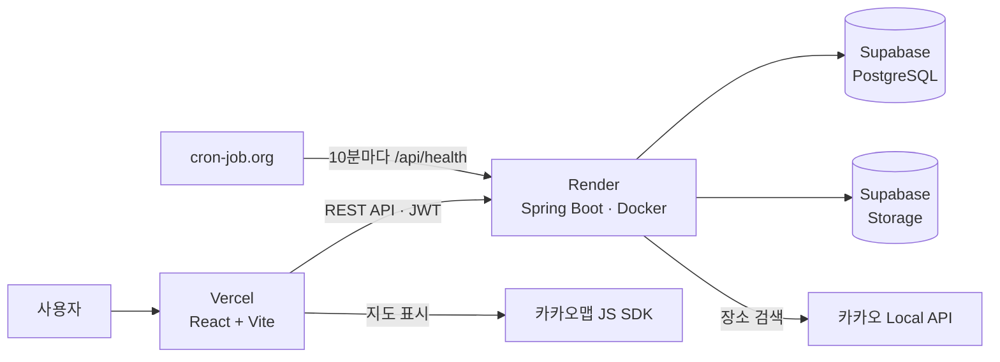
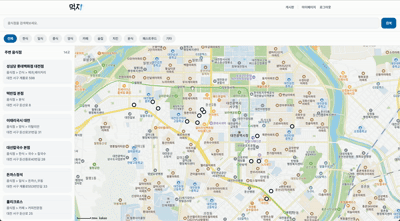
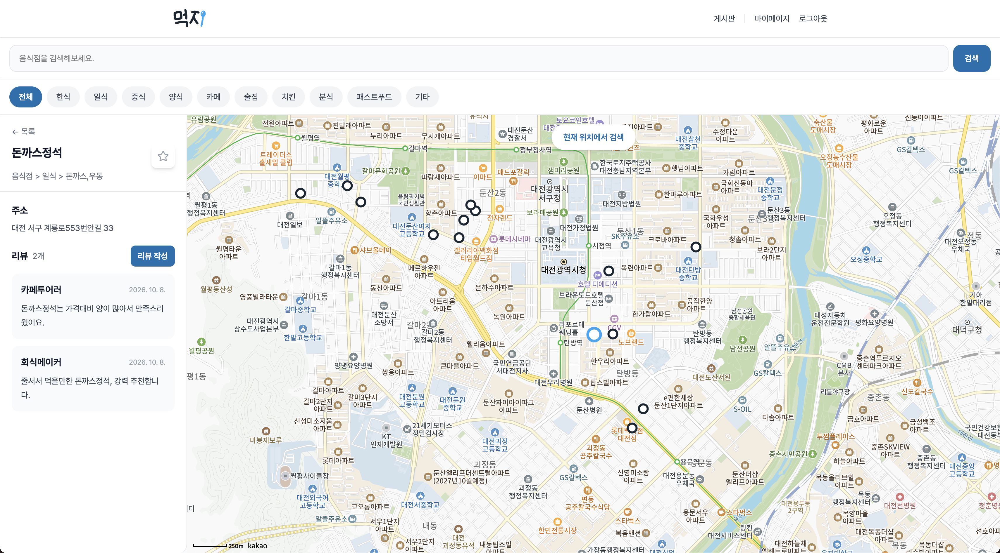
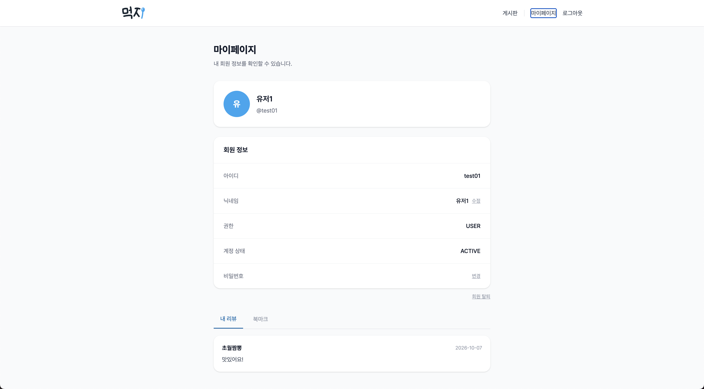
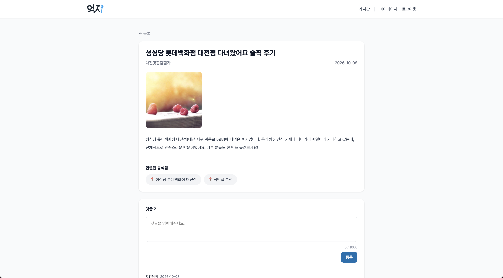
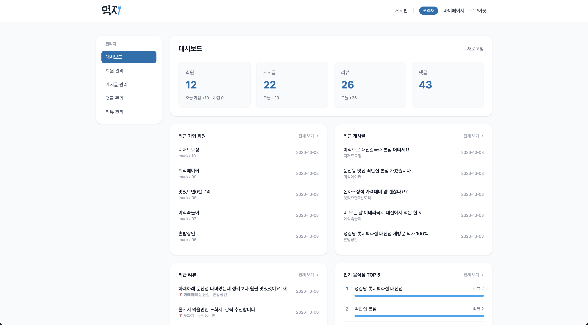
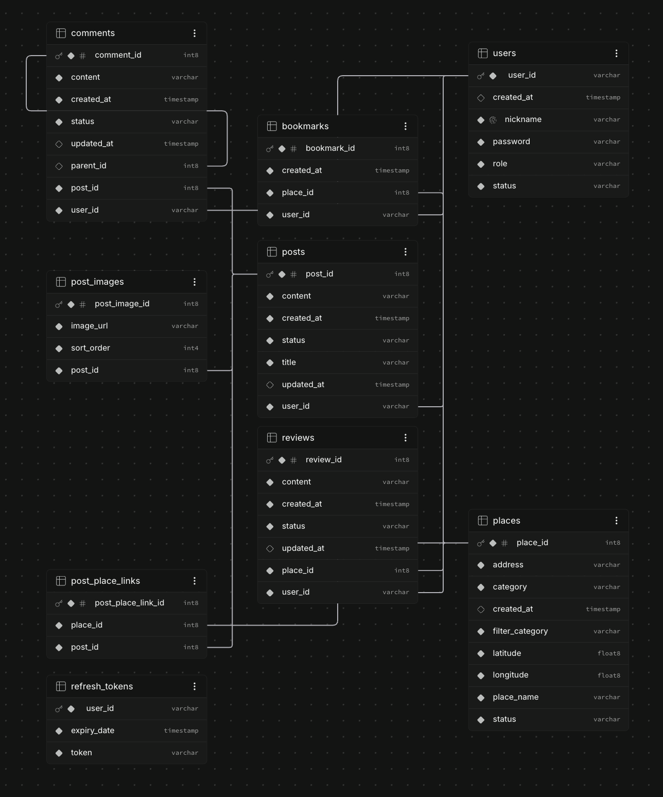

# 🥄 먹지 (Muckzi)

> "오늘 뭐 먹지?" 고민을 지도 위에서 해결하는 음식점 리뷰 서비스

🔗 **서비스 바로가기** : https://muckzi.vercel.app  
📘 **API 문서 (Swagger)** : https://muckzi-back.onrender.com/swagger-ui/index.html  
💻 **프론트엔드 저장소** : https://github.com/sanghyeonJ/muckzi-front

> ⚠️ 무료 서버를 사용하고 있어 첫 접속 시 응답이 조금 느릴 수 있습니다.

 

## 📌 프로젝트 소개

매번 반복되는 "뭐 먹지?"라는 고민, 막상 고르려면 선택지가 너무 많아 결정이 더 어려워집니다.

**먹지**는 지도를 기반으로 내 주변 음식점의 리뷰와 추천을 한눈에 확인하고, 메뉴 결정 장애를 빠르게 해결할 수 있도록 만든 음식점 리뷰 서비스입니다. 음식점에 리뷰를 남기고, 마음에 드는 곳은 북마크하고, 자유게시판에서 다른 사람들과 맛집 정보를 나눌 수 있습니다.

| 항목 | 내용                               |
| --- |----------------------------------|
| 개발 기간 | 약 5주                             |
| 개발 인원 | 1인 (기획 · 디자인 · 프론트엔드 · 백엔드 · 배포) |

 

## 🔑 테스트 계정

| 구분 | 아이디                 | 비밀번호        |
| --- |---------------------|-------------|
| 일반 회원 | muckzi01 ~ muckzi10 | Muckzi1234! |

관리자 기능은 아래 [주요 기능](#-주요-기능)의 화면으로 확인하실 수 있습니다.

 

## 🛠 기술 스택

| 구분 | 기술 |
| --- | --- |
| Backend | Java 17, Spring Boot 4.1.1, Spring Data JPA, Spring Security, JWT, Springdoc(Swagger) |
| Frontend | React 19, Vite, Tailwind CSS v4 |
| Database | PostgreSQL (Supabase) |
| Storage | Supabase Storage |
| External API | 카카오맵 JavaScript SDK, 카카오 Local REST API |
| Deploy | Render (Docker), Vercel |

 

## 🏗 아키텍처

 

## ✨ 주요 기능

### 지도 기반 음식점 검색
- 카카오맵 위에서 주변 음식점을 검색하고 바로 리뷰를 확인
- 모바일에서는 바텀시트를 드래그해 지도와 목록을 함께 사용

### 리뷰 & 북마크
- 음식점별 리뷰 작성 · 수정 · 삭제
- 마음에 드는 음식점 북마크

### 마이페이지
- 닉네임 · 비밀번호 변경, 내가 쓴 리뷰, 북마크 목록, 회원 탈퇴

### 자유게시판
- 게시글 CRUD, 이미지 업로드, 음식점 링크 첨부
- 댓글 · 답글

### 관리자 페이지 (`/admin`)
- 대시보드, 회원 관리(차단), 게시글 · 댓글 · 리뷰 관리 및 복구

 

## 🗂 ERD

 

## 💡 기술적 고민

### JWT + 리프레시 토큰
- 액세스 토큰은 짧게 유지하고, 리프레시 토큰을 DB 테이블(`REFRESH_TOKENS`)에 저장해 재발급과 로그아웃 시 무효화가 가능하도록 구현했습니다.
- 현재는 DB로 관리하고 있으며, 추후 Redis로 옮길 예정입니다.

### 차단 회원 처리
- 차단(BLACK) 회원은 로그인 단계에서 막도록 했습니다.
- 이미 발급된 액세스 토큰까지 매 요청마다 회원 상태를 확인하면 모든 요청에 DB 조회가 추가되기 때문에, 토큰 만료(1시간)에 맡기는 방식을 선택했습니다.

### Soft Delete 정책
- 탈퇴한 회원의 글은 내용을 유지하고 작성자를 "탈퇴한 회원"으로 표시합니다.
- 게시글 · 댓글 · 리뷰는 실제로 지우지 않고 삭제 상태로 관리해, 관리자가 복구할 수 있도록 했습니다.

 

## 🔥 트러블슈팅

### 1. N+1 문제

- **문제** : 목록 조회 시 연관된 엔티티를 가져오느라 데이터 개수만큼 쿼리가 추가로 실행됨
- **해결** : 연관 엔티티를 함께 가져오도록 `fetch join`을 적용해 쿼리 수를 줄임

### 2. 한글 입력 길이 초과 (Oracle)

- **문제** : Oracle의 `VARCHAR2`가 기본적으로 바이트 기준이라, 한글은 글자당 여러 바이트를 차지해 설정한 길이보다 적게 입력해도 오류 발생
- **해결** : 컬럼 길이를 글자 기준(`CHAR`)으로 변경

### 3. 배포 환경에서의 이미지 저장

- **문제** : 로컬에서는 문제가 없었지만, Render는 배포나 재시작 시 새 컨테이너로 교체되어 서버 로컬 `uploads` 폴더에 저장한 이미지가 사라짐
- **해결** : 이미지를 서버 밖의 외부 스토리지인 Supabase Storage에 저장하도록 업로드 방식 전환

### 4. iOS 입력창 자동 확대

- **문제** : 아이폰 Safari에서 입력창을 누르면 화면이 확대됨 (16px 미만 글자 크기의 입력창에서 발생)
- **해결** : 모바일 화면에서만 입력창 글자 크기를 16px로 지정

 

## ☁️ 배포 환경 구성

- **Oracle → PostgreSQL** : 로컬 Oracle(Docker)로 개발한 뒤, 무료 운영 환경에 맞춰 Supabase(PostgreSQL)로 전환
- **무료 서버 슬립 대응** : Render는 15분 미사용 시 슬립, Supabase는 7일 미활동 시 일시정지되어 cron-job.org로 `/api/health`를 10분마다 호출

 

## ⚙️ 환경변수

민감한 정보는 코드에 포함하지 않고 환경변수로 분리해 관리합니다.
로컬에서는 IntelliJ 실행 설정, 배포 환경에서는 Render 환경변수로 주입합니다.

| 이름                   | 설명                     |
| ---------------------- | ------------------------ |
| `DB_URL`               | PostgreSQL 접속 URL      |
| `DB_USERNAME`          | DB 사용자명              |
| `DB_PASSWORD`          | DB 비밀번호              |
| `JWT_SECRET`           | JWT 서명 키              |
| `KAKAO_REST_API_KEY`   | 카카오 Local REST API 키 |
| `SUPABASE_URL`         | Supabase 프로젝트 URL    |
| `SUPABASE_SECRET_KEY`  | Supabase Storage 접근 키 |
| `SUPABASE_BUCKET`      | 이미지 저장 버킷 이름    |
| `CORS_ALLOWED_ORIGINS` | 허용할 프론트엔드 주소   |

 

## 🔭 향후 개선

- 리프레시 토큰 저장소를 DB에서 **Redis**로 마이그레이션
- 재발급 시 리프레시 토큰도 새로 발급하는 **리프레시 토큰 로테이션** 적용
